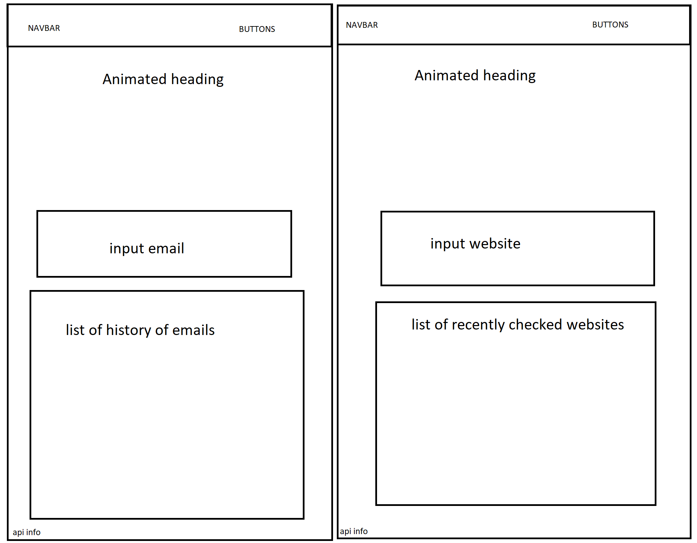

# Spam Email Project

## Daily Log

#### 9/15

-   Began work with API.
-   Began page styling and content.
-   Added page components

#### 9/17

-   Added more styles.
-   Added search bar.
-   Added navbar.
-   Added second website page.

#### 9/20

-   Finished websites page.
-   Finished the google api grabbing.
-   Finished all components.
-   Fixed styling and responsive design.

## To-do List

-   [x] Main SASS and React // Completed 9/20
-   [x] Reference Images // Completed 9/17
        
-   [x] Responsive Design // Completed 9/20
-   [x] Data Grabbing // Completed 9/20
-   [x] Pages // Completed 9/20
    -   [x] Email Checker // Completed 9/17
        -   [x] SCSS
        -   [x] React
    -   [x] Website Checker // Completed 9/20
        -   [x] SCSS
        -   [x] React
-   [x] Components // Completed 9/20
    -   [x] Checked Emails
        -   [x] SCSS
        -   [x] React
    -   [x] Checked Websites
        -   [x] SCSS
        -   [x] React
    -   [x] Email Input
        -   [x] SCSS
        -   [x] React
    -   [x] Website Input
        -   [x] SCSS
        -   [x] React
    -   [x] Navbar
        -   [x] SCSS
        -   [x] React
